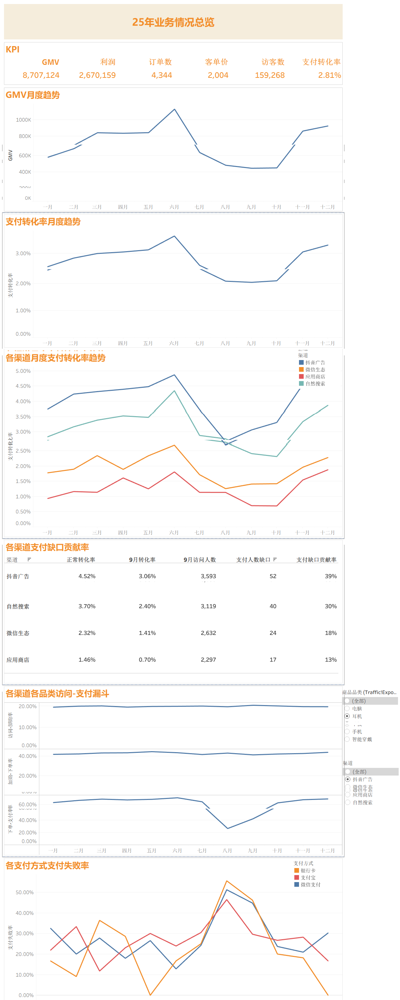

# 电商经营分析 | ecommerce-business-analysis

基于 **Excel / Power Query / Tableau** 的数据分析求职作品集，围绕经营指标拆解、异常定位和可视化，追踪 2025 年电商 GMV 下滑对应的业务环节。

**项目使用模拟业务数据，不是真实企业生产数据。** 不涉及真实企业背景、上线效果或业务收益承诺。

> 当前核验状态：全年 KPI 与原始 Dashboard 一致；“抖音广告×耳机”的漏斗范围及数值已由作者人工确认，与文件复算一致。详见 [上传前核验记录](docs/validation_report.md)。

## 项目背景

本项目以模拟电商经营场景为对象，回答三个问题：GMV 在什么时间出现异常？访客规模、客单价与支付转化分别呈现怎样的变化？异常进一步集中在哪个渠道、商品品类及转化环节？

分析从全年经营概览出发，逐步下钻到渠道、渠道×品类、转化漏斗、订单状态和支付方式，以现有数据支持的证据确定排查范围。

## 数据说明

订单及流量分析范围为 2025 年；流量数据覆盖 2025-01-01 至 2025-12-31。

| 数据表 | 内容与粒度 | 数据行数 | 关键字段 |
| --- | --- | ---: | --- |
| orders | 订单明细，一行一条商品明细 | 12,432 | 明细ID、订单ID、用户ID、商品ID、下单时间、订单状态、渠道、支付方式 |
| products | 商品信息，一行一个商品 | 30 | 商品ID、商品品类、商品售价、商品成本 |
| users | 用户信息，一行一个用户 | 3,000 | 用户ID、注册时间、注册渠道、地区 |
| traffic | **日期 × 渠道 × 商品品类** | 7,300 | 访客数、加购人数、下单人数、支付人数 |

数据文件：[原始数据.xlsx](data/原始数据.xlsx)、[清洗数据.xlsx](data/清洗数据.xlsx)。清洗文件包含 `orders_export`、`users_export`、`traffic_export` 三个输出表，分别为 12,432、3,000、7,300 行。

订单ID可在多条商品明细中重复，订单数须去重；明细ID才是明细表主键。流量人数按现有聚合表求和，不能解释为全年跨日期、渠道和品类去重的独立用户数。

## 技术栈

| 工具 | 项目中的用途 |
| --- | --- |
| Excel | 保存原始业务表及处理后的数据输出 |
| Power Query | 字段类型整理、关联完整性检查、合并商品成本与品类、计算有效销售额与利润 |
| Tableau | Relationship 数据建模、指标计算、趋势与漏斗可视化、筛选下钻 |

## 数据处理

1. 检查缺失值、Error、主键唯一性，并核对订单与用户、商品的关联完整性。本次对现有文件只读复核，未发现空值、常见错误值、主键重复或关联缺失；这是文件核验结果，不代表存在单独保存的历史检查日志。
2. Power Query 按商品ID合并商品品类与商品成本，并从下单时间提取订单日期。工作簿保留了用户、商品关联的 Left Anti 检查查询。
3. 仅“已完成”订单计入有效销售额和利润：有效销售额为实付金额；利润为实付金额减去商品成本乘购买数量。其他状态两项均为 0。
4. 输出 `orders_export`、`users_export`、`traffic_export`，供 Tableau 使用。

利润为上述商品成本口径，未扣除广告、物流、平台手续费等费用，不能称为净利润。缺失值和唯一性的交互检查过程没有独立历史日志；现有查询和本次复核的区别见核验记录。

## 数据模型

Tableau 使用逻辑层 **Relationship**，已核对打包工作簿中的关系定义：

| 关系 | 关联字段 |
| --- | --- |
| orders_export ↔ users_export | 用户ID = 用户ID |
| orders_export ↔ traffic_export | 订单日期 = 日期；订单来源渠道 = 渠道；商品品类 = 商品品类 |

订单明细和聚合流量的粒度不同。保留 Relationship，不把订单与流量改为物理 Join，避免同一组流量指标随订单明细重复。Power Query 合并商品维度与这里的 Tableau 逻辑层关系是不同处理步骤。

## 核心指标

以下为全年、全渠道、全品类口径；金额沿用源数据单位，Dashboard 显示整数。

| 指标 | 定义 | 全年 Dashboard |
| --- | --- | ---: |
| GMV | SUM(有效销售额)，仅已完成订单 | 8,707,124 |
| 利润 | SUM(利润)，仅已完成订单 | 2,670,159 |
| 已完成订单数 | 已完成订单的 COUNTD(订单ID) | 4,344 |
| 客单价 | GMV ÷ 已完成订单数 | 2,004 |
| 访客数 | SUM(traffic_export.访客数) | 159,268 |
| 加购率 | SUM(加购人数) ÷ SUM(访客数) | 非顶部 KPI 卡片 |
| 下单转化率 | SUM(下单人数) ÷ SUM(访客数) | 非顶部 KPI 卡片 |
| 支付转化率 | SUM(支付人数) ÷ SUM(访客数) | 2.81% |

原文件 GMV 为 8,707,123.85，利润为 2,670,158.85，客单价约为 2,004.4024，与整数显示一致。支付人数合计为 4,469，不等于已完成订单数 4,344：两者来源及统计对象不同，不能互换。

## Dashboard



[查看完整尺寸原图](images/dashboard_overview.png) · [下载 Tableau 打包工作簿](tableau/ecommerce-business-analysis.twbx)

截图包含全年 KPI、GMV 与支付转化率趋势、渠道转化趋势、渠道缺口、漏斗及支付方式失败率。顶部为全量经营概览，漏斗和支付方式图使用“抖音广告×耳机”筛选，不能将局部图的结论推广为全量结果。

原图按原字节保存，未重绘、改色或修改文字、数值。长截图存在局部显示接缝，底部图表触及图片边缘；为避免裁切遗漏上下文，本次仅保留完整截图。

## 分析过程

**GMV异常 → 指标拆解 → 支付转化异常 → 渠道 → 支付人数缺口 → 渠道×品类 → 漏斗 → 订单状态 → 支付失败 → 支付方式 → 当前数据无法继续确认技术原因。**

1. 识别 2025 年 7—10 月 GMV 处于低位；不是指这四个月严格逐月下降。
2. 对比访客数、客单价与支付转化率。访客数、客单价也有变化，支付转化率同期下降更突出，需要继续下钻。
3. 以 3—6 月作为对照期，按渠道估算 9 月支付人数缺口，确定排查优先级。
4. 拆到渠道×品类后，“抖音广告×耳机”的估算缺口最突出，继续观察逐段漏斗。
5. 结合该组合的订单状态和各支付方式失败率，将排查范围收敛到支付环节。

完整的计算口径、月度数据及证据边界见 [分析记录](docs/analysis_summary.md)。

## 核心结论

- 7—10 月 GMV 明显低于 3—6 月对照期，支付转化率同期下降；现有趋势支持优先排查转化环节，不构成因果证明。
- 9 月估算支付人数缺口主要来自：抖音广告约 52（39%）、自然搜索约 40（30%）、微信生态约 24（18%）、应用商店约 17（13%）。这是对照期转化率下的估算差额，不是已确认流失用户或可回收收益。
- 继续按渠道×品类拆分，“抖音广告×耳机”最突出；现有文件支持异常主要集中于“下单→支付”。
- 在“抖音广告×耳机”范围内，8—9 月支付失败订单数相对 3—6 月增加，三种支付方式的失败率相对对照期均上升，不能归因于单一支付方式。
- **只能定位支付环节异常，不能证明具体支付系统故障。** 技术原因仍需支付错误码、接口日志等证据。

**已确认的“抖音广告×耳机”漏斗：**

| 环节 | 正常期3—6月 | 9月 | 变化（百分点） |
| --- | ---: | ---: | ---: |
| 访问→加购 | 19.69% | 20.24% | +0.55 |
| 加购→下单 | 43.65% | 41.27% | -2.38 |
| 下单→支付 | 68.88% | 42.31% | -26.57 |

抖音广告×耳机在9月的访问→加购率基本稳定并略有上升，加购→下单仅小幅下降，而下单→支付率从68.88%下降至42.31%，下降26.57个百分点。异常主要集中在下单→支付环节。

## 项目局限

- 模拟数据用于展示分析方法，不能据此推断真实企业表现或量化业务收益。
- 3—6 月“正常期”是本项目的对照选择，不是经过实验验证的反事实；季节、促销和流量结构变化可能影响比较。
- 流量表是聚合人数，订单表是商品明细，无法逐人还原完整行为路径。GMV = 已完成订单数 × 客单价；由于支付人数与已完成订单数不等，不能把“访客数 × 支付转化率 × 客单价”直接当成此数据的严格恒等式。
- “支付失败率”按支付失败订单数 ÷ 订单总数计算，不是支付请求级的接口失败率；无法识别重试、错误码或责任系统。
- Excel 内部保留原本的本地源路径和作者元数据，跨电脑刷新前需人工处理，详见 [上传前核验记录](docs/validation_report.md)。

## 仓库导航与查看方式

```text
ecommerce-business-analysis/
├── README.md
├── .gitignore
├── data/
│   ├── 原始数据.xlsx
│   └── 清洗数据.xlsx
├── tableau/
│   └── ecommerce-business-analysis.twbx
├── images/
│   └── dashboard_overview.png
└── docs/
    ├── analysis_summary.md
    └── validation_report.md
```

先阅读本页与分析记录；查看交互内容时打开 `.twbx`。该文件已打包清洗数据，包内数据与 `data/清洗数据.xlsx` 字节一致。GitHub 可直接查看文档与图片，Tableau 交互需在支持 `.twbx` 的 Tableau 应用中查看。若要重新运行 Power Query，应在 Excel 中人工重新指定本仓库的原始数据文件；当前整理没有更改查询源或 Tableau 内部逻辑，也未在桌面应用中执行刷新验证。
